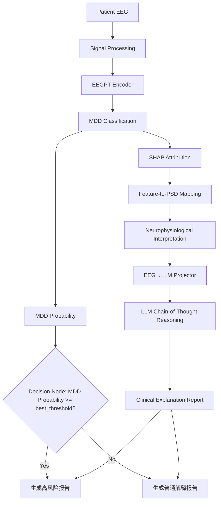

# E-MDD Workflow

**E-MDD**（Explainable MDD diagnosis）是一个端到端可解释抑郁症辅助诊断框架。系统首先利用 **EEGPT** 提取脑电表征并完成 **MDD 分类**，然后通过 **SHAP** 获取关键决策特征，进一步建立潜在特征与脑区、频段 **PSD** 特征之间的映射关系，实现神经生理层面的解释。最后通过 **EEG→LLM Projector** 将脑电表征映射到语言空间，结合 **Chain-of-Thought** 推理生成符合临床认知逻辑的诊断解释报告。

> 本目录为 **GitHub 发布包**（专业目录命名、相对路径、无日期文件夹）。

---

## Highlights

- **End-to-End Explainable MDD Diagnosis Workflow**  
构建覆盖 EEG 预处理、特征提取、抑郁症分类、可解释性分析、跨模态语义对齐与 CoT 诊断解释生成的端到端 Workflow，支持 step0–step5 及外部测试集评估的一键式编排，并集成依赖检查、运行日志与实验管理机制。
- **Subject-Level Cross-Validation for Reliable Clinical Evaluation**  
基于 StratifiedGroupKFold 实现被试级五折交叉验证，严格避免同一受试者数据同时出现在训练集与验证集中，有效降低数据泄露风险，提高模型评估的临床可信度与泛化能力。
- **Decision-Driven Report Generation Mechanism**  
引入基于内部验证集最优阈值（best_threshold）的决策节点，根据模型输出风险水平动态生成高风险诊断报告或常规解释报告，实现从分类结果到临床反馈的自动化决策闭环。
- **Hierarchical XAI Framework with Neurophysiological Mapping**  
构建 epoch-level 与 subject-level 双层可解释性分析框架，通过 SHAP 识别关键决策特征，并建立潜在特征维度与脑区、频段 PSD 特征之间的映射关系，将深度模型决策依据转化为具有神经生理意义的解释证据。
- **Cross-Modal EEG-to-LLM Alignment for Clinical Reasoning**  
冻结 7B 大语言模型参数，仅训练轻量级 EEG→LLM Projector（2-layer MLP），实现脑电表征向语言语义空间的跨模态对齐，并结合 Chain-of-Thought（CoT）推理生成符合临床逻辑的自然语言诊断解释。
- **Reproducible Research and Experiment Tracking**  
设计标准化实验记录机制，自动保存模型配置、训练日志、评估结果及解释报告至独立运行目录（runs//），保障实验过程可追溯、结果可复现。

---

## Workflow 架构




> `best_threshold` 由 step3 在训练折内搜索得到，并与代码中的 `eegpt_mdd_prob >= best_threshold` 决策逻辑保持一致。


| Step      | 脚本                                      | 产出                                               |
| --------- | --------------------------------------- | ------------------------------------------------ |
| **step0** | `preprocessing/matlab/`                 | `data/eeg/train_6/` 等                            |
| step1     | `step1.py`                              | `emdd_core/features/*.npy`                       |
| step2     | `step2.py`                              | `emdd_core/subject_power_with_asym.csv`          |
| step3     | `emdd_core/step3_classify_shap.py`      | `emdd_core/artifacts/classification/`            |
| step4     | `emdd_core/step4_train_projector.py`    | `emdd_core/artifacts/projector/`                 |
| step5     | `llm_explanation/step5_generate_cot.py` | `llm_explanation/outputs/cot/test_epoch_cot.csv` |
| eval      | `emdd_core/eval_external_test.py`       | `emdd_core/artifacts/external_eval/`             |


---

## 目录结构

```
emdd-pipeline/
├── emdd_workflow.py              # CLI 入口
├── workflow/                     # 编排核心
├── configs/                      # 默认 + local 示例
├── preprocessing/matlab/         # step0
├── emdd_core/                    # 分类、投影、外部评估（原 0419）
│   ├── step3_classify_shap.py
│   ├── step4_train_projector.py
│   ├── eval_external_test.py
│   ├── features/                 # step1/2 产出
│   └── artifacts/
│       ├── classification/       # step3 报告与 checkpoint
│       ├── projector/            # step4 权重
│       └── external_eval/        # eval 图表与指标
├── llm_explanation/              # CoT 生成（原 0420）
│   ├── step5_generate_cot.py
│   └── outputs/cot/
├── data/   vendor/   models/     # 说明 README（数据/权重不提交）
└── docs/
```

---

## 快速开始

```bash
pip install -r requirements-workflow.txt
copy configs\emdd_local.yaml.example configs\emdd_local.yaml   # 按需编辑

python emdd_workflow.py list
python emdd_workflow.py check --all
python emdd_workflow.py run --all --dry-run
```

外部资源准备见 `data/README.md`、`vendor/README.md`、`models/README.md`。

---

## 代表性结果


| 模型              | AUC   | Subject ACC |
| --------------- | ----- | ----------- |
| EEGPT + 临床特征    | 0.846 | 0.824       |
| EEGNet512       | 0.894 | 0.765       |
| EEGConformer512 | 0.857 | 0.824       |


详见 `[docs/sample_outputs.md](docs/sample_outputs.md)`。

---

## 重新生成本包

在开发树根目录运行：

```bash
python tools/package_github_release.py
```

会覆盖 `emdd-pipeline/` 下的脚本副本；`configs/emdd_default.yaml` 与 `workflow/artifacts.py` 若在打包后手动改过，需一并提交。

---

## License

Research / portfolio use. Dataset follows Mumtaz et al. public release terms.