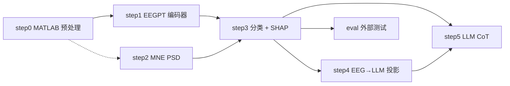

# E-MDD Pipeline

**E-MDD**（Explainable MDD diagnosis）端到端架构：**EEGPT 脑电编码器** → 分类头 → XAI（SHAP）→ LLM CoT 可解释推理。

> 本目录为 **GitHub 发布包**（专业目录命名、相对路径、无日期文件夹）。

---

## 亮点

- **完整 pipeline 编排**：`step0~step5 + eval` 一键/分步运行，带依赖检查与运行日志
- **被试级 5 折交叉验证**：`StratifiedGroupKFold`，避免同一被试泄露
- **双层 XAI 报告**：epoch 级 + subject 级 SHAP，dim↔PSD 物理映射
- **多模态 CoT**：冻结 7B LLM，仅训练 EEG→LLM 投影层（2-layer MLP）
- **可复现运行记录**：每次 run 写入 `runs/<timestamp>/`

---

## 架构



| Step | 脚本 | 产出 |
|------|------|------|
| **step0** | `preprocessing/matlab/` | `data/eeg/train_6/` 等 |
| step1 | `step1.py` | `emdd_core/features/*.npy` |
| step2 | `step2.py` | `emdd_core/subject_power_with_asym.csv` |
| step3 | `emdd_core/step3_classify_shap.py` | `emdd_core/artifacts/classification/` |
| step4 | `emdd_core/step4_train_projector.py` | `emdd_core/artifacts/projector/` |
| step5 | `llm_explanation/step5_generate_cot.py` | `llm_explanation/outputs/cot/test_epoch_cot.csv` |
| eval | `emdd_core/eval_external_test.py` | `emdd_core/artifacts/external_eval/` |

---

## 目录结构

```
emdd-pipeline/
├── emdd_workflow.py              # CLI 入口
├── workflow/                     # 编排核心
├── configs/                      # 默认 + local 示例
├── preprocessing/matlab/         # step0
├── emdd_core/                    # 分类、投影、外部评估（原 0419）
│   ├── step3_classify_shap.py
│   ├── step4_train_projector.py
│   ├── eval_external_test.py
│   ├── features/                 # step1/2 产出
│   └── artifacts/
│       ├── classification/       # step3 报告与 checkpoint
│       ├── projector/            # step4 权重
│       └── external_eval/        # eval 图表与指标
├── llm_explanation/              # CoT 生成（原 0420）
│   ├── step5_generate_cot.py
│   └── outputs/cot/
├── data/   vendor/   models/     # 说明 README（数据/权重不提交）
└── docs/
```

---

## 快速开始

```bash
pip install -r requirements-workflow.txt
copy configs\emdd_local.yaml.example configs\emdd_local.yaml   # 按需编辑

python emdd_workflow.py list
python emdd_workflow.py check --all
python emdd_workflow.py run --all --dry-run
```

外部资源准备见 `data/README.md`、`vendor/README.md`、`models/README.md`。

---

## 代表性结果

| 模型 | AUC | Subject ACC |
|------|-----|-------------|
| EEGPT + 临床特征 | 0.846 | 0.824 |
| EEGNet512 | 0.894 | 0.765 |
| EEGConformer512 | 0.857 | 0.824 |


---

## 重新生成本包

在开发树根目录运行：

```bash
python tools/package_github_release.py
```

会覆盖 `emdd-pipeline/` 下的脚本副本；`configs/emdd_default.yaml` 与 `workflow/artifacts.py` 若在打包后手动改过，需一并提交。

---

## License

Research / portfolio use. Dataset follows Mumtaz et al. public release terms.
