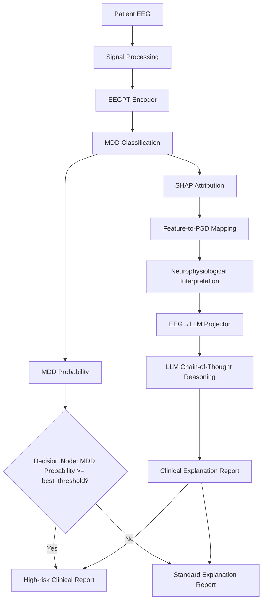

# Workflow Architecture (E-MDD)

## 架构命名

- **E-MDD**：端到端可解释抑郁症辅助诊断 Workflow（Explainable MDD diagnosis）
- **EEGPT**：仅作为 step1 的预训练脑电**编码器**，输出 512 维表征
- **MDDClassificationHead**：E-MDD 的分类模块（step3）
- **EEGProjector**：E-MDD 的多模态桥接模块（step4，512→LLM hidden）
- **LLM CoT**：E-MDD 的可解释输出模块（step5）

## 设计目标

1. **可复现**：固定随机种子、被试级划分、运行日志归档
2. **可解释**：SHAP + Feature-to-PSD 映射 + 神经生理解释 + LLM CoT
3. **可编排**：Workflow 统一配置、分步执行、依赖检查
4. **可分流**：通过 `eegpt_mdd_prob >= best_threshold` 决策节点生成高风险报告或普通解释报告

## Workflow 数据流



E-MDD 首先对 Patient EEG 进行信号处理，再利用 EEGPT Encoder 提取脑电表征并完成 MDD Classification。分类模块输出 `eegpt_mdd_prob` 后进入 Decision Node：当 `eegpt_mdd_prob >= best_threshold` 时，Workflow 生成高风险报告；否则生成普通解释报告。`best_threshold` 由 step3 在训练折内搜索得到，并在 step5 中继续复用，保证报告分流与分类器真实决策逻辑一致。解释链路并行使用 SHAP Attribution 获取关键决策特征，通过 Feature-to-PSD Mapping 将潜在维度映射到脑区、频段 PSD 特征，再形成 Neurophysiological Interpretation。最后，EEG→LLM Projector 将脑电表征投影到语言空间，LLM Chain-of-Thought Reasoning 综合分类结果、SHAP 证据与神经生理解释，生成 Clinical Explanation Report。

## 工程数据流

```
Raw BDF/EDF
    → step0 MATLAB: [可选 ICA] → 6s epoch → train/test 划分 → [Z-norm]
    → data/eeg/train_6/*.set
    → step1 EEGPT encoder → 512-d .npy
    → step2 MNE PSD + asymmetry
    → step3 MDD classification + SHAP + probability decision
    → step4 EEG→LLM projector
    → step5 LLM CoT clinical explanation report
    → eval external test
```

## 核心模块

### MDDClassificationHead (step3)

- 输入：512 维 EEGPT 特征
- 结构：`Linear(512→256) → BN → ReLU → Dropout → Linear(256→2)`
- 训练：加权交叉熵 + label smoothing
- 输出：`eegpt_mdd_prob`、Decision Node 分流结果、SHAP 报告

### SHAP + Feature-to-PSD Mapping (step2/3)

- 输入：分类模型关键 SHAP 维度、PSD 与不对称性特征
- 映射：将潜在 EEGPT 特征关联到脑区与频段 PSD 指标
- 输出：神经生理层面的可解释证据，用于支撑报告中的临床逻辑

### EEGProjector (step4/5)

- 输入：512 维 EEGPT 特征
- 结构：`Linear(512→1024) → GELU → Linear(1024→3584)`
- 训练：冻结 LLM，最小化 next-token loss（标签文本 MDD/HC）
- 输出：1 个 LLM 兼容 token embedding

### CoT Generator (step5)

- 输入：epoch_report + MDD probability + Decision Node 结果 + TOP3 SHAP 特征 + 神经生理解释 + 投影 EEG token
- 输出：结构化 CoT 与 Clinical Explanation Report（高风险报告 / 普通解释报告）
- 评估：特征对齐率、术语准确率、解释一致性

## Workflow 层

| 模块 | 职责 |
|------|------|
| `configs/emdd_default.yaml` | E-MDD 默认路径与脚本映射（相对仓库根） |
| `configs/emdd_local.yaml` | 本机路径覆盖（不提交 Git，见 `.example`） |
| `workflow/config.py` | 加载与解析配置 |
| `workflow/artifacts.py` | 每步 input/output 契约 |
| `workflow/runner.py` | 执行、日志、symlink、subprocess |
| `workflow/adapters/` | step1/2 配置驱动适配 |

## 防泄露策略

- `StratifiedGroupKFold` 按 `real_subject_id` 分组
- 阈值在 train 折内搜索，应用到 val/test
- step3 完成后才复制对应 fold 的 `.npy` 到 train/val 目录

## 扩展

- 对照模型 baseline 脚本（开发树可选）：EEGNet512、EEGConformer512 pipeline
- 发布包仅包含 `emdd_core/` 与 `llm_explanation/` 主链路
